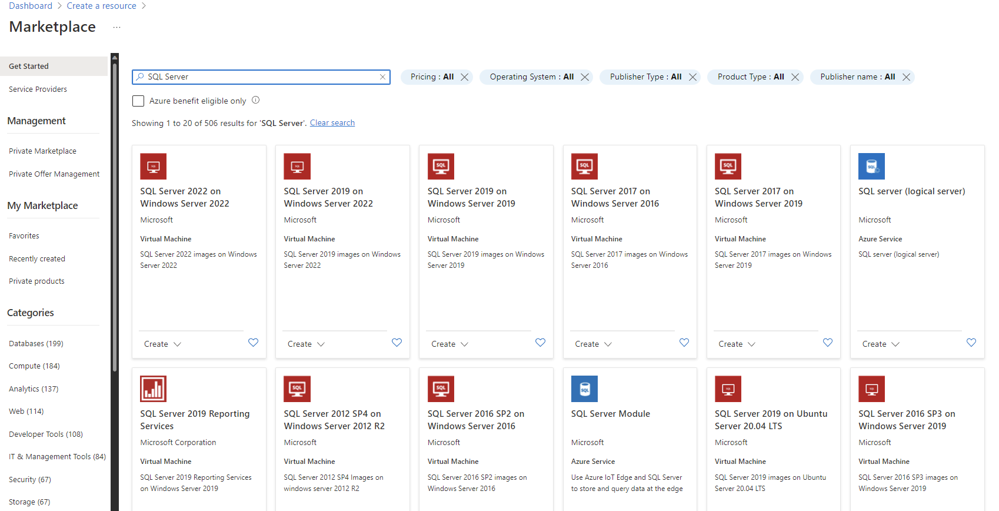

# Workshop: Modernizing Your Data Estate With SQL Ground-to-Cloud
#### <i>A Microsoft workshop from the SQL Server team</i>

 <h2>04 - Microsoft Azure SQL Improvements</h2>

In the previous modules, you learned about how to <a href="https://github.com/sqlballs/mSQLg2c/blob/Josh/modules/02-AuditingYourDataEstateArchitecture.md" target="_blank"> <b>audit your data estate</b></a>, and the most recent <a href="https://github.com/sqlballs/mSQLg2c/blob/Josh/modules/03-SQLServerImprovements.md" target="_blank"><b>SQL Server improvements</a>.</b> In this module, you will learn about the different options available for running SQL Server in Azure and all the considerations that are involved with running an architecture in the cloud, like Manageability, Availability, Performance, Security, and Deployment.

(As a reminder, make sure you check out the <a href="https://github.com/sqlballs/mSQLg2c/blob/Josh/modules/01-SetupandWorkshopMethodology.md" target="_blank"><b>Pre-Requisites</b></a> page before you start. You'll need all of the items loaded there before you can proceed with the workshop.)

Using the <a href="https://github.com/sqlballs/mSQLg2c/blob/main/modules/02-AuditingYour%20DataEstateArchitecture.md">processes, tools and procedures from the Auditing  Module</a>, the WideWorldImporters company has completed an initial audit of their data estate. They have settled on many architectural improvements in the latest version of SQL Server on-premises, and have decided to move to the latest version for many of their systems, using the Compatibilit settings where required. They have also started a test installation of SQL Server running on Red Hat Linux, and developers are now using SQL Server in Containers. 

WideWorldImporters is now turning its attention to workloads they can use in the Microsoft Azure platform. They are particularly interested in the security, availability and elastic scale available in a cloud service.

For consisitency, they are continuing their evaluation using the same categories that they investigated for the on-premises installations of SQL Server:

<dl>
  <dt><a href="#4.1" target="_blank">4.1 - Deployment Options</dt>
  <dt><a href="#4.2" target="_blank">4.2 - Manageability</dt>
  <dt><a href="#4.3" target="_blank">4.3 - Availability</dt>
  <dt><a href="#4.4" target="_blank">4.4 - Performance</dt>
  <dt><a href="#4.5" target="_blank">4.5 - Security</dt>
  <dt><a href="#4.6" target="_blank">4.6 - Development</dt>
  <dt><a href="#4.7" target="_blank">4.7 - Analytics</dt>
</dl>

<h2 id="4.1">4.1 Deployment Options</h2></a>
The Microsoft Azure platform is updated on a continuous basis. It is difficult to pinpoint a time for new improvements, so WideWorld Importers is focusing on the current state of Microsoft Azure, with an eye on some of the larger improvements that have been made recently.

> Since Microsoft Azure and the Azure Data Platform are constantly updated, there are improvements that are not included in this Module. You can keep track of these changes in a few locations, such as the <a href="https://azure.microsoft.com/en-us/updates/">Azure Updates feed</a>, the <a href="https://learn.microsoft.com/en-us/azure/azure-sql/database/doc-changes-updates-release-notes-whats-new?view=azuresql">Azure SQL Database "What's New" page, and the <a href="https://www.youtube.com/results?search_query=data+exposed">Data Exposed video channel</a>, as well as the <a href="https://techcommunity.microsoft.com/t5/azure-sql-blog/azure-sql-news-update-a-year-in-review/ba-p/3034023">"Year In Review" Posts on the Azure SQL Blog</a>.

Wide World Importers does have a basic understanding of the Microsoft Azure Platform, and has deployed database offerings in the past. If you are new to these topics, consult the following references:

- <a href="https://learn.microsoft.com/en-us/certifications/azure-fundamentals/">Microsoft Certified: Azure Fundamentals</a> - a hands-on free course on the basics of the Microsoft Azure platform
- <a href="https://learn.microsoft.com/en-us/certifications/azure-database-administrator-associate/">Microsoft Certified: Azure Database Administrator Associate</a> - a free hands-on course that guides you through the fundamentals of the Azure SQL architecture

With a firm understanding of the basics of Microsoft Azure and the Azure SQL Database environments, you can continue on with your modernization evaluation.

Microsoft Azure has three basic deployment options for a SQL Server database. All of these use the same basic RDBMS engine, with a high level of compatibility for your data operations. The primary decision point is how much control and responsibility you want for each type of deployment. The data platform in Microsoft Azure includes:

WideWorld Importers has decided to take their Data Estate audit of the applications they have and decide if it is a candidate for Microsoft Azure, and which of these workloads requires a higher level of control, and which are better suited to a more fully managed environment.

<h4>SQL Server on Microsoft Azure Virtual Machines</h4>
As <a href="https://github.com/sqlballs/mSQLg2c/blob/main/modules/03-SQLServerImprovements.md#3.1">you learned in the last Module, SQL Server can be installed directly on a Virtual Machine environment</a> just as it is on bare metal hardware, with a few considerations. This provides the highest level of control and responsibility - you own and control everything from the operating system to the installation of SQL Server. You can choose various Microsoft Windows or Linux offerings for your installation of SQL Server.

Microsoft Azure provides a huge array of Virtual Machine sizes, configurations, and licensing (or no licensing) options. You can <a href="https://azure.microsoft.com/en-us/pricing/vm-selector/">find a sizing tool at this reference</a>.

After you select a Microsoft Azure Virtual Machine that fits your needs, you can install SQL Server Instances on it like any other Virtual Machine environment. Using Azure Virtual Machines gives you all of the advantages of the Azure Platform, such as scaling storage quickly, rapid backup and restore operations, cloning systems, scripted and automated deployments, flexible networking into subnets and Network Security Groups, global regions for deployments, extensive logging, and the Microsoft Defender security environment, <a href="https://learn.microsoft.com/en-us/azure/virtual-machines/">and many other advantages</a>.

Once you've installed SQL Server on a Microsoft Azure Virtual Machine, you can register the installation with the <i>Azure Resource Provider</i> system which enhances the management, monitoring and other aspects of Microsoft Azure for your instance. You can <a href="https://techcommunity.microsoft.com/t5/sql-server-blog/benefit-from-resource-provider-registration-when-self-installing/ba-p/742794">learn more about that process at this reference</a>.

While you can install SQL Server on a Virtual Machine, Microsoft Azure has multiple sizes, operating systems and more with SQL Server pre-installed, all with pay-as-you-go or license migration options. You can <a href="https://learn.microsoft.com/en-us/azure/azure-sql/virtual-machines/windows/sql-server-on-azure-vm-iaas-what-is-overview?view=azuresql">learn more about these deployments at this reference</a>.

Once you have your image selected, you can <a href="https://docs.microsoft.com/en-us/azure/virtual-machines/windows/sql/virtual-machines-windows-sql-performance">find a checklist to learn how to implement optimal performance of your Virtual Machines at this reference</a>, and you can find <a href="https://docs.microsoft.com/en-us/azure/virtual-machines/windows/sql/virtual-machines-windows-sql-server-storage-configuration">guidance for proper storage configurations for SQL Server on Azure Virtual Machiness at this reference</a>.  

> If you are evaluating SQL Server on Red Hat Linux (RHEL) Azure VMs, you can <a href="https://azure.microsoft.com/en-us/resources/sql-server-on-rhel-azure-vms-operations-guide/">find an operations guide at this reference</a>. 
  
<h4>SQL Server Managed Instance</h4>
For the next level of control, WideWorld Importers has decided some workloads require the broadest SQL Server Instance database engine compatibility with all the benefits of a fully managed and evergreen platform as a service. Azure SQL Managed Instance has near 100% compatibility with the latest SQL Server (Enterprise Edition) database engine, providing a native virtual network (VNet) implementation that addresses common security concerns, and a business model favorable for existing SQL Server customers. 

SQL Managed Instance allows you to "lift and shift" on-premises applications to the cloud with minimal application and database changes. Azure SQL Managed Instance preserves all PaaS capabilities (automatic patching and version updates, automated backups, high availability) that drastically reduce management overhead. It can also be used as a Disaster Recovery (DR) site, among many other interoperations with on-premises and in-cloud data systems. These advantages will be discussed in the next Module.

Several <a href="https://learn.microsoft.com/en-us/azure/azure-sql/managed-instance/doc-changes-updates-release-notes-whats-new?view=azuresql#general-availability-ga">new improvements are announced for the latest release of SQL Managed Instance</a>, including:

- <a href="https://learn.microsoft.com/en-us/azure/azure-sql/managed-instance/service-endpoint-policies-configure?view=azuresql">Endpoint policies</a> allow you to configure which Azure Storage accounts can be accessed from a SQL Managed Instance subnet. Grants an extra layer of protection against inadvertent or malicious data exfiltration
- <a href="https://learn.microsoft.com/en-us/azure/azure-sql/managed-instance/instance-pools-overview?view=azuresql">Instance pools</a> are a convenient and cost-efficient way to migrate smaller SQL Server instances to the cloud
- <a href="https://learn.microsoft.com/en-us/azure/azure-sql/managed-instance/managed-instance-link-feature-overview?view=azuresql">Managed Instance link</a> gives you an online replication of SQL Server databases hosted anywhere to Azure SQL Managed Instance
- <a href="https://learn.microsoft.com/en-us/azure/azure-sql/managed-instance/managed-instance-link-feature-overview?view=azuresql">Maintenance window advance notifications for databases</a> allows you to configure a non-default maintenance window, and recieve advanced notifications of maintenance
- <a href="https://learn.microsoft.com/en-us/azure/azure-sql/managed-instance/log-replay-service-migrate?view=azuresql">Migrate with Log Replay Service</a> allows you to migrate databases from SQL Server to SQL Managed Instance by using Log Replay Service
- <a href="https://learn.microsoft.com/en-us/sql/azure-data-studio/extensions/sql-database-project-extension-sdk-style-projects">You can now use Microsoft.Build.Sql for SDK-style SQL projects</a> in the SQL Database Projects extension in Azure Data Studio or VS Code. SDK-style SQL projects are especially advantageous for applications shipped through pipelines or built in cross-platform environments
- <a href="https://learn.microsoft.com/en-us/sql/database-engine/configure-windows/sql-server-service-broker">There is new support for cross-instance message exchange</a> using Service Broker on Azure SQL Managed Instance
- <a href="https://learn.microsoft.com/en-us/sql/azure-data-studio/extensions/sql-database-project-extension">A new SQL Database Projects extension</a> allow you to develop databases for Azure SQL Database with Azure Data Studio and VS Code. A SQL project is a local representation of SQL objects that comprise the schema for a single database, such as tables, stored procedures, or functions
- <a href="https://learn.microsoft.com/en-us/azure/azure-monitor/insights/sql-insights-overview">SQL Insights is a comprehensive solution</a> for monitoring any product in the Azure SQL family. SQL Insights uses dynamic management views to expose the data you need to monitor health, diagnose problems, and tune performance
- <a href="https://learn.microsoft.com/en-us/azure/azure-sql/managed-instance/replication-transactional-overview?view=azuresql">Transactional Replication improvements</a> allow you to replicate the changes from your tables into other databases in SQL Managed Instance, SQL Database, or SQL Server. You can also update your tables when some rows are changed in other instances of SQL Managed Instance or SQL Server
- <a href="https://learn.microsoft.com/en-us/azure/azure-sql/managed-instance/threat-detection-configure?view=azuresql">New threat detections</a> notifies you of security threats detected to your database

You can <a href="https://learn.microsoft.com/en-us/azure/azure-sql/managed-instance/sql-managed-instance-paas-overview?view=azuresql">learn more about Azure SQL Managed Instance at this reference</a>.

<h3>Azure SQL Database</h3>
WideWorld Importers has now reviewed the highest level of control and responsibility (Azure Virtual Machines), and then evaluated abstracting the platform, operating system, and many of the responsibilities for the SQL Server deployment (Azure SQL Managed Instance). Using the Data Estate Audit process from the first Module, they find they are investing more heavily in web-based applications, not only for customers, but for some internal applications as well. 

They want the highest level of compatibility for the databases these applications use, but they do not want to stand up more SQL Server Instances, or further task the data professionals to create and manage databases. They do want automatic backups, elastic scale, automatic tuning (wherever possible) and geographic flexibility. They would like to keep the option of moving any of these databases to their other Instances or deployments. 

Azure SQL Database is a fully managed platform as a service (PaaS) database engine that handles most of the database management functions such as upgrading, patching, backups, and monitoring without user involvement. Azure SQL Database is always running on the latest stable version of the SQL Server database engine and patched OS with 99.99% availability. PaaS capabilities built into Azure SQL Database enable you to focus on the domain-specific database administration and optimization activities that are critical.

With Azure SQL Database, you can create a highly available and high-performance data storage layer for the applications and solutions in Azure. SQL Database works with a variety of modern cloud applications because it enables you to process both relational data and non-relational structures, such as graphs, JSON, spatial, and XML.

Azure SQL Database is based on the latest stable version of the Microsoft SQL Server database engine. You can use advanced query processing features, such as high-performance in-memory technologies and intelligent query processing. In fact, the newest capabilities of SQL Server are released first to Azure SQL Database, and then to SQL Server itself. You get the newest SQL Server capabilities with no overhead for patching or upgrading, tested across millions of databases.

SQL Database enables you to easily define and scale performance within two different purchasing models: a vCore-based purchasing model and a DTU-based purchasing model. SQL Database is a fully managed service that has built-in high availability, backups, and other common maintenance operations. Microsoft handles all patching and updating of the SQL and operating system code. You don't have to manage the underlying infrastructure.

In addition, WideWorld Importers has learned that their <a href="https://learn.microsoft.com/en-us/azure/azure-sql/database/local-dev-experience-sql-database-emulator?view=azuresql">developers can each have a local running instance of the Azure SQL Database offering in a local emulator</a>. This allows each developer to follow the newly established DevOps process they are setting up in the IT department.

> The Azure SQL Platform is constantly evolving. You can <a href="https://learn.microsoft.com/en-us/azure/azure-sql/database/doc-changes-updates-release-notes-whats-new?view=azuresql">find a list of the latest improvements at this reference</a>.

As WideWorld Importers works through the process of evaluating workloads for Azure SQL Database, they are faced with various choices and decisions.

<b>Decision 1: The purchasing model for optimal cost management</b>  
There are two options for the cost-model in Azure SQL Databases: <a href="https://docs.microsoft.com/en-us/azure/sql-database/sql-database-service-tiers-vcore">Virtual core (vCore)-based deployments (recommended)</a> or <a href="https://docs.microsoft.com/en-us/azure/sql-database/sql-database-service-tiers-dtu
">Database transaction unit (DTU)-based pricing</a>.

The vCore-based model is recommended because it allows you to independently choose compute and storage resources, while the DTU-based model is a bundled measure of compute, storage and I/O resources, which means you have less control over paying only for what you need. This model also allows you to use the <a href="https://azure.microsoft.com/pricing/hybrid-benefit/">Azure Hybrid Benefit for SQL Server</a> for additional cost savings. In the <a href="https://docs.microsoft.com/en-us/azure/sql-database/sql-database-service-tiers-vcore">vCore model</a>, your costs include:  

- Compute resources (the service tier + the number of vCores and the amount of memory + the generation of hardware)
- The type and amount of data and log storage
- Backup storage (<a href="https://docs.microsoft.com/en-us/azure/storage/common/storage-designing-ha-apps-with-ragrs">such as read-access, geo-redundant storage (RA-GRS)</a>). 
  
> For the purposes of this workshop, we'll focus on the vCore purchasing model (recommended), but you can <a href="https://docs.microsoft.com/en-us/azure/sql-database/sql-database-purchase-models">compare vCores and DTUs at this reference</a>.

<b>Decision 2: The service tier for performance and availability</b>
There are three <i>tiers</i> available in the vCore model for Azure SQL Database:
 - <a href="https://docs.microsoft.com/en-us/azure/sql-database/sql-database-service-tier-general-purpose">General purpose</a>:  Suitable for most business workloads. Offers budget-oriented, balanced, and scalable compute and storage options
 - <a href="https://docs.microsoft.com/en-us/azure/sql-database/sql-database-service-tier-business-critical">Business critical</a> - Business applications with low-latency response requirements. Offers highest resilience to failures by using several isolated replicas. This is the only tier that can leverage <a href="https://docs.microsoft.com/en-us/azure/sql-database/sql-database-in-memory">in-memory OLTP to improve performance</a>
- <a href="https://docs.microsoft.com/en-us/azure/sql-database/sql-database-service-tier-hyperscale">Hyperscale</a>: For business workloads with highly scalable storage and read-scale requirements

You can find a <a href="https://azure.microsoft.com/en-gb/blog/understanding-and-leveraging-azure-sql-database-sla/">discussion of the service level agreements that set an expectation for uptime and performance at this reference</a>. This resource will help you make an informed decision about which tier to use. A <a href="https://www.youtube.com/watch?v=l7FUNJd5TSE">video discussion is available at this reference</a>.

For a deeper explanation between the three tiers (including scenarios), you can also see <a href="https://docs.microsoft.com/en-us/azure/sql-database/sql-database-service-tiers-vcore#service-tier-characteristics">this referfence on the service-tier characteristics</a>.

<b>Decision 3: The provisioning model for best use patterns</b> 
If you choose the <i>General Purpose within Single databases</i> and the <i>vCore-based model</i>, you have an additional decision to make regarding the compute costs:

- <i>Provisioned compute</i> is designed for regular usage patterns with higher average compute utilization over time, or multiple databases using elastic pools
- <i>Serverless compute</i> is designed for intermittent, unpredictable usage with lower average compute utilization over time. Serverless has auto-pause and resume capabilities (with a time delay you set), meaning when your database is paused, costs involve storage

For a deeper explanation between the two compute options (including scenarios), you can <a href="https://docs.microsoft.com/en-us/azure/sql-database/sql-database-serverless#comparison-with-provisioned-compute-tier">find a detailed comparison in the documentation at this reference</a>. If you're looking for compute cost saving opportunities, you can prepay for compute resources with Azure SQL Database reserved capacity. You can <a href="https://docs.microsoft.com/en-us/azure/sql-database/sql-database-reserved-capacity">learn more at this reference</a>.

<b>Decision 4: Choose the hardware generation for proper sizing</b>
The vCore model lets you choose the generation of hardware you want to run the offering on:
- Gen4: Up to 24 logical CPUs based on Intel E5-2673 v3 (Haswell) 2.4-GHz processors, vCore = 1 PP (physical core), 7 GB per core, attached SSD
- Gen5: Up to 80 logical CPUs based on Intel E5-2673 v4 (Broadwell) 2.3-GHz processors, vCore = 1 LP (hyper-thread), 5.1 GB per core, fast eNVM SSD  

The Gen4 hardware offers substantially more memory per vCore. However, Gen5 hardware allows you to scale up compute resources much higher.

> If you choose General Purpose within Single databases and want to use the serverless compute tier, Gen5 hardware is the only option

<h4>Azure SQL Database Hyperscale</h4>
WideWorld Importers does have one mobile application that they anticipate to have extremely high demand, throughput, and size requirements. 

The Hyperscale service tier in Azure SQL Database is the newest service tier in the vCore-based purchasing model. This service tier is a highly scalable storage and compute performance tier that uses the Azure architecture to scale out the storage and compute resources for an Azure SQL Database substantially beyond the limits available for the General Purpose and Business Critical service tiers.

You can <a href="https://learn.microsoft.com/en-us/azure/azure-sql/database/service-tier-hyperscale?view=azuresql">learn more about Azure SQL Hyperscale at this reference</a>.

There are many options and decisions for moving a workload to the Azure SQL offerings.  The Azure SQL environment provides flexibility so you get exactly what you need. You can <a href="https://azure.microsoft.com/en-us/pricing/details/sql-database/managed/">find a summary of the service tier options with some additional considerations for cost at this reference</a>.

<b>Activity: Install the Azure SQL Database Emulator</b>

In this Activity you will Install the Azure SQL Database Emulator.

<b>Steps</b>

- Open <a href="https://learn.microsoft.com/en-us/azure/azure-sql/database/local-dev-experience-set-up-dev-environment?view=azuresql&tabs=vscode">this reference</a>
- If time and resrouces permit, install the components as listed in the steps at that reference
- If you do not have the resources on your system, or you do not have the time to follow those steps, review with the instructor and watch their demonstration of the process

<h2 id="4.2">4.2 Manageability</h2>
While managing SQL Server in the cloud is somewhat different than managing on premises instances, the tools and methodologies that you will use similar to the tools and methodologies that you used in your on-premises environment, whether it is a graphical user interface (GUI) or command-line tool.

You can use SQL Server Management Studio, SQLCMD, and the other on-premises tools you reviewed in the last Module for on-premises tooling. In this Module, you will focus on the Azure Portal, the Azure Data Studio tool, and the Azure Command-line Interface (<i>az</i> commands in a cross-platform tool).

<b>The Microsoft Azure Portal</b>
The Microsoft Azure Portal is used to deploy, manage, monitor, or delete resources in your subscription. It has sections, or "blades" for each of these operations and can be accessed with all major web browsers as well as cell phones. You can also set up various "Dashboards" to show your resrouces and other information.

You can <a href="https://learn.microsoft.com/en-us/azure/azure-portal/azure-portal-overview">learn more about the Azure Portal at this reference</a>.

<b>Azure Data Studio</b>
Azure Data Studio is a cross-platform database tool for data professionals using on-premises and cloud data platforms on Windows, macOS, and Linux. Azure Data Studio offers a modern editor experience with IntelliSense, code snippets, source control integration, and an integrated terminal. It's engineered with the data platform user in mind, with built-in charting of query result sets and customizable dashboards.

You can <a href="https://docs.microsoft.com/en-us/sql/azure-data-studio/what-is?view=sql-server-2017 
" target="_blank">learn more about Azure Data Studio here</a>.

Azure Data Studio is a highly extensible tool that helps developers to manage and develop against multiple data processing and storage engines. Its versatility through the use of application extensions allows it to be as useful as the developer can make it. Multiple extensions exist for helping developers to migrate to Azure SQL, develop "clean" looking code, monitor and manage Azure Synapse, work on PostgreSQL instances, or even develop using Jupyter Notebooks

<i>Jupyter Notebooks</i>
A Jupyter <i>Notebook</i> is a web-page-based interface consisting of *Cells* that can contain text (using the Markdown specification) or code. The code depends on the Kernel that has been installed for the Notebook. Traditionally, Python and R Kernels are installed by default. Notebook Servers run <i>.ipynb</i> files (the Notebooks). 

Notebooks are JSON files that contain areas called <i>Cells</i>, which have text or code in them. When you double-click a Notebook, the Notebook server renders and can display text or run code, such as R or Python, using a <i>Kernel</i>. Cells can hold text (such as Markdown, HTML, or LaTeX) which you can mix together, or Code. Double-click a Cell in a Notebook to edit it, and then click the "Run" button to render what you typed. Code runs and displays an output below the cell. You can toggle the result for code to show or hide it.

<i>Markdown</i> is a simplified markup language for text. Use it for general text and simple graphics. You can <a href="https://www.markdowntutorial.com/" target="_blank">read more about Markdown here</a>, and <a href="https://github.com/adam-p/markdown-here/wiki/Markdown-Cheatsheet" target="_blank">there's a great cheat-sheet on Markdown here</a>. 

You'll use Notebooks within Azure Data Studio to work with SQL Server on-premises, in-cloud, or in the new Development Environment you set up in the last Activity. You ca learn <a href="https://jupyter-notebook.readthedocs.io/en/stable/" target="_blank">more about Jupyter Notebooks here</a>.  

<b>Azure Command-Line Interface</b>
You can work with all of your Azure properties using a command-line tool. The Azure command-line interface (Azure CLI) is a set of commands used to create and manage Azure resources. The Azure CLI is available across Azure services and is designed to get you working quickly with Azure, with an emphasis on automation. It runs on Windows, Linux, and macOS, and there is also a CLI interface in the Azure Portal and it's available as an extension in the Azure Data Studio tool.

You can <a href="https://learn.microsoft.com/en-us/cli/azure/">learn more about the Azure Command-Line Iterface at this reference</a>.

 

 

<b>Activity: Review the Azure Data Studio Overview</b>

In this Activity you will review the Azure Data Studio tool, and optionally follow along on your local system. 

<b>Steps</b>

- <a href="https://learn.microsoft.com/en-us/sql/azure-data-studio/download-azure-data-studio?view=sql-server-ver16">Install the Azure Data Studio if you have not already done so using this reference</a>
- Open this reference to <a href="https://www.youtube.com/watch?v=Orv7fptVoUA">review a video walkthrough of the Azure Data Studio tool</a>

<h2 id="4.3">4.3 Availability</h2>
One of the advantages of the a managed service is the Availability resources you have. WideWorld Importers is very focused on ensuring Business Continuity, and they believe the Microsoft Azure platform can assist with this process. They have reviewed the resources on <a href="https://docs.microsoft.com/en-us/azure/sql-database/sql-database-business-continuity">databases and Business Continuity at this reference</a>, and are interested in the "Avaialability Zone" concepts.

> WideWorld Importers is also  interested in the on-premises to Azure and Azure to on-premises links, but will review that as a separate task, which you will cover in the next Module

Azure Availability Zones are physically separate locations within each Azure region that are tolerant to local failures.

You can <a href="https://learn.microsoft.com/en-us/azure/availability-zones/az-overview">learn more about Azure Availability Zones at this reference</a>.

In addition, the Azure Data Platform offers other advantages:

* [Azure SQL Database High availability](https://docs.microsoft.com/en-us/azure/sql-database/sql-database-high-availability) of Azure SQL Database guarantees your databases are up and running 99.99% of the time, no need to worry about maintenance/downtimes.

* [Azure SQL Managed Instance Auto-Failover Groups](https://learn.microsoft.com/en-us/azure/azure-sql/managed-instance/auto-failover-group-sql-mi?view=azuresql&tabs=azure-powershell) feature allows you to manage the replication and failover of all user databases in a managed instance to another Azure region.

* [Automated backups](https://docs.microsoft.com/en-us/azure/sql-database/sql-database-automated-backups) are created and use Azure read-access geo-redundant storage (RA-GRS) to provide geo-redundancy.
* [Long term backup retention](https://docs.microsoft.com/en-us/azure/sql-database/sql-database-long-term-retention) enables you to store specific full databases for up to 10 years.
* [Geo-replication](https://docs.microsoft.com/en-us/azure/sql-database/sql-database-active-geo-replication) by creating readable replicas of your database in the same or different Azure Region.

<b>Activity: Review Azure SQL Availability</b>

In this Activity you will review a video which walks you through various considerations when evaluating high availability and disaster recovery needs and features in Azure SQL.

<b>Steps</b>

https://www.youtube.com/watch?v=OJVXH_dPAEA

<h2 id="4.4">4.4 Performance</h2>

Azure can feel like a forgien land compared to the familiarity of SQL Server on a VM.  In moments such as that it is importaint to remember that this is the same database engine we have on premise.  The key to performance tuning on premises is the same in Azure.

* [Explain estimated and actual query plans.](https://learn.microsoft.com/en-us/training/modules/explore-query-performance-optimization/3-explain-estimated-actual?ns-enrollment-type=learningpath&ns-enrollment-id=learn.wwl.optimize-query-performance-sql-server) The topic of actual versus estimated execution plans can be confusing. The difference is that the actual plan includes runtime statistics that aren't captured in the estimated plan. The operators used, and order of execution will be the same as the estimated plan in nearly all cases. 
* [The Query Data Store](https://learn.microsoft.com/en-us/training/modules/explore-query-performance-optimization/5-explore-query-store) The SQL Server Query Store is a per-database feature that automatically captures a history of queries, plans, and runtime statistics to simplify performance troubleshooting and query tuning. It also provides insight into database usage patterns and resource consumption. This is on by default in all Azure SQL Databases.
* [Wait Statistics](https://learn.microsoft.com/en-us/training/modules/evaluate-performance-improvements/2-describe-wait-statistics?ns-enrollment-type=learningpath&ns-enrollment-id=learn.wwl.optimize-query-performance-sql-server) When SQL Server executes any process it must wait for resources.  As that occurs Wait Statistics are accumulated by the SQL OS.  Wait Statistics will tell you what Azure SQL is waiting on.  If it is a hardware wait stat, then you may need to consider increasing your service teir.
* [Auto Scaling](https://docs.microsoft.com/en-us/azure/sql-database/sql-database-scale-resources) Azure Serverless database or regular scaling Azure SQL Database, Managed Instance, or Synapse may be key to resolving hardware performance.
* [Tune and maintain indexes.](https://learn.microsoft.com/en-us/training/modules/evaluate-performance-improvements/3-tune-and-maintain-indexes?ns-enrollment-type=learningpath&ns-enrollment-id=learn.wwl.optimize-query-performance-sql-server) The most common (and most effective) method for tuning T-SQL queries is to evaluate and adjust your indexing strategy.
* [Automatic tuning](https://docs.microsoft.com/en-us/azure/sql-database/sql-database-automatic-tuning) analyzes your workload and provides you the recommendations that can optimize performance of your applications by adding indexes, removing unused indexes, and automatically fixing the query plan issues.
* [Built-in intelligence](https://docs.microsoft.com/en-us/azure/sql-database/sql-database-intelligent-insights) automatically identifies the potential issues in your workload and provides you the recommendations that can [help you to fix the problems](https://azure.microsoft.com/en-us/blog/ai-helped-troubleshoot-an-intermittent-sql-database-performance-issue-in-one-day/). 

<b>Activity: Performance Improvements</b>

Watch videos

<b>Automatic Tuning</b>

Automatic tuning in Azure SQL is a great feature that analyzes your workload and gives recommndations on configuration changes you can make to improve performance. In this video, you are given an overview of the feature.

<b>Steps</b>

 [Improve Performance Tuning with Automatic Tuning](https://www.youtube.com/watch?v=HQantpWg3sg)

<h2 id="4.5">4.5 Security</h2>

Security is at the core of everything we do.  There is not just one are of concern for each product but multiple shared capabilities in Azure.

For an overview of Azure SQL Database and Azure SQL Managed Instance security capabilities review this <a href="https://learn.microsoft.com/en-us/azure/azure-sql/database/security-overview?view=azuresql">MS Learn article.</a> 

* <b>[Network security](https://learn.microsoft.com/en-us/azure/azure-sql/database/security-overview?view=azuresql#network-security) </b>- To help protect customer data, firewalls prevent network access to the server until access is explicitly granted based on IP address or Azure Virtual network traffic origin.

* <b>[IP firewall rules](https://learn.microsoft.com/en-us/azure/azure-sql/database/security-overview?view=azuresql#network-security)</b> - IP firewall rules grant access to databases based on the originating IP address of each request. For more information, see <a href="https://learn.microsoft.com/en-us/azure/azure-sql/database/firewall-configure?view=azuresql">Overview of Azure SQL Database and Azure Synapse Analytics firewall rules.</a>

* <b>[Virtual network firewall rules](https://learn.microsoft.com/en-us/azure/azure-sql/database/security-overview?view=azuresql#virtual-network-firewall-rules)</b> - Virtual network service endpoints extend your virtual network connectivity over the Azure backbone and enable Azure SQL Database to identify the virtual network subnet that traffic originates from. To allow traffic to reach Azure SQL Database, use the SQL service tags to allow outbound traffic through Network Security Groups.

* <b>[Access management](https://learn.microsoft.com/en-us/azure/azure-sql/database/security-overview?view=azuresql#access-management)</b> - Managing databases and servers within Azure is controlled by your portal user account's role assignments. 

* <b>[Authentication](https://learn.microsoft.com/en-us/azure/azure-sql/database/security-overview?view=azuresql#authentication)</b> - Authentication is the process of proving the user is who they claim to be. Azure SQL Database and SQL Managed Instance support SQL authentication and Azure AD authentication. SQL Managed instance additionally supports Windows Authentication for Azure AD principals.

* <b>[Authorization](https://learn.microsoft.com/en-us/azure/azure-sql/database/security-overview?view=azuresql#authorization)</b> - Authorization refers to controlling access on resources and commands within a database. This is done by assigning permissions to a user within a database in Azure SQL Database or Azure SQL Managed Instance. Permissions are ideally managed by adding user accounts to database roles and assigning database-level permissions to those roles. Alternatively an individual user can also be granted certain object-level permissions. 

* <b>[Row-level security](https://learn.microsoft.com/en-us/azure/azure-sql/database/security-overview?view=azuresql#row-level-security)</b> - Row-Level Security enables customers to control access to rows in a database table based on the characteristics of the user executing a query (for example, group membership or execution context). Row-Level Security can also be used to implement custom Label-based security concepts.

* <b>[SQL auditing in Azure Monitor logs and Event Hubs](https://learn.microsoft.com/en-us/azure/azure-sql/database/security-overview?view=azuresql#sql-auditing-in-azure-monitor-logs-and-event-hubs)</b> - SQL Database and SQL Managed Instance auditing tracks database activities and helps maintain compliance with security standards by recording database events to an audit log in a customer-owned Azure storage account. Auditing allows users to monitor ongoing database activities, as well as analyze and investigate historical activity to identify potential threats or suspected abuse and security violations. 

* <b>[Advanced Threat Protection](https://learn.microsoft.com/en-us/azure/azure-sql/database/security-overview?view=azuresql#advanced-threat-protection)</b>Advanced Threat Protection is analyzing your logs to detect unusual behavior and potentially harmful attempts to access or exploit databases. Alerts are created for suspicious activities such as SQL injection, potential data infiltration, and brute force attacks or for anomalies in access patterns to catch privilege escalations and breached credentials use. Alerts are viewed from the Microsoft Defender for Cloud, where the details of the suspicious activities are provided and recommendations for further investigation given along with actions to mitigate the threat. Advanced Threat Protection can be enabled per server for an additional fee. 

* <b>[Transport Layer Security](https://learn.microsoft.com/en-us/azure/azure-sql/database/security-overview?view=azuresql#transport-layer-security-encryption-in-transit)</b>SQL Database, SQL Managed Instance, and Azure Synapse Analytics enforce encryption (SSL/TLS) at all times for all connections. This ensures all data is encrypted "in transit" between the client and server irrespective of the setting of Encrypt or TrustServerCertificate in the connection string.

* <b>[Transparent Data Encryption (Encryption-at-rest)](https://learn.microsoft.com/en-us/azure/azure-sql/database/security-overview?view=azuresql#transparent-data-encryption-encryption-at-rest)</b> SQL Database, SQL Managed Instance, and Azure Synapse Analytics enforce encryption (SSL/TLS) at all times for all connections. This ensures all data is encrypted "in transit" between the client and server irrespective of the setting of Encrypt or TrustServerCertificate in the connection string.

* <b>[Key management with Azure Key Vault](https://learn.microsoft.com/en-us/azure/azure-sql/database/security-overview?view=azuresql#key-management-with-azure-key-vault)</b> Bring Your Own Key (BYOK) support for Transparent Data Encryption (TDE) allows customers to take ownership of key management and rotation using Azure Key Vault, Azure's cloud-based external key management system.

* <b>[Always Encrypted (Encryption-in-use)](https://learn.microsoft.com/en-us/azure/azure-sql/database/security-overview?view=azuresql#always-encrypted-encryption-in-use)</b> Always Encrypted is a feature designed to protect sensitive data stored in specific database columns from access (for example, credit card numbers, national identification numbers, or data on a need to know basis). This includes database administrators or other privileged users who are authorized to access the database to perform management tasks, but have no business need to access the particular data in the encrypted columns.

* <b>[Dynamic data masking](https://learn.microsoft.com/en-us/azure/azure-sql/database/security-overview?view=azuresql#dynamic-data-masking)</b> Dynamic data masking limits sensitive data exposure by masking it to non-privileged users. Dynamic data masking automatically discovers potentially sensitive data in Azure SQL Database and SQL Managed Instance and provides actionable recommendations to mask these fields, with minimal impact to the application layer.

* <b>[Data discovery and classification](https://learn.microsoft.com/en-us/azure/azure-sql/database/security-overview?view=azuresql#data-discovery-and-classification)</b> Data discovery and classification (currently in preview) provides basic capabilities built into Azure SQL Database and SQL Managed Instance for discovering, classifying and labeling the sensitive data in your databases. Discovering and classifying your utmost sensitive data (business/financial, healthcare, personal data, etc.) can play a pivotal role in your organizational Information protection stature

* <b>[Vulnerability assessment](https://learn.microsoft.com/en-us/azure/azure-sql/database/security-overview?view=azuresql#dynamic-data-masking)</b> Vulnerability assessment is an easy to configure service that can discover, track, and help remediate potential database vulnerabilities with the goal to proactively improve overall database security. Vulnerability assessment (VA) is part of the Microsoft Defender for SQL offering, which is a unified package for advanced SQL security capabilities. 

* <b>[Virtual Network Service Endpoints](https://learn.microsoft.com/en-us/azure/virtual-network/virtual-network-service-endpoints-overview)</b> extend your virtual network over the Azure networking backbone and identify, and block if need be, traffic from a specific azure virtual network subnet that the traffic is originating from.

<b>Activity: TODO: Activity Name</b>

Manage security and Microsoft Defender for Cloud

<b>Defender for Cloud</b>

Sign into Microsoft Learn on this [link](https://learn.microsoft.com/en-us/training/modules/azure-sql-secure-data/8-exercise-advanced-data-security?ns-enrollment-type=learningpath&ns-enrollment-id=learn.azure-sql-fundamentals).  Complete Unit 8 of 10 Secure your data with Azure SQL.  

<b>Steps</b>

Follow the steps in Exercise - Manage security and Microsoft Defender for Cloud.

<b>Steps</b>

Procede to Unit 9 Learn about Data classification, dynamic data masking, and SQL Audit in this MS Learn Module.  

<h2 id="4.6">4.6 Development</h2>

When you have your envrionment in Azure there is a world of additional options availble to your architecture and development practices.  In this section we will explore some of the development features in Azure SQL and in Azure. 

* <b>[Spider-man Homecoming Twitter Sentiment Analysis](https://learn.microsoft.com/en-us/archive/blogs/deeperinsights/how-to-measure-twitter-sentiment-with-azure-logic-apps-sql-database-and-power-bi)</b> - A true Azure Development story showing how in less than an hour and a few clicks you can get real world data, use Congnative Services, evaluate sentiment, and enrich data in your Azure SQL Database.  Then you can report off of it in Power BI. 

<h2 id="4.7">4.7 Analytics</h2>

content

<h4>Microsoft Azure Synapse</h4>

Azure Synapse is an enterprise analytics service that accelerates time to insight across data warehouses and big data systems. Azure Synapse brings together the best of SQL technologies used in enterprise data warehousing, Spark technologies used for big data, Data Explorer for log and time series analytics, Pipelines for data integration and ETL/ELT, and deep integration with other Azure services such as Power BI, CosmosDB, and AzureML.

For a deeper overview of Azure Synapse read this MS Learn article <a href="https://learn.microsoft.com/en-us/azure/synapse-analytics/overview-what-is">Azure Synapse Overview - What is Azure Synapse?</a>

<b>For Further Study</b>

<ul>
        <li><a href="url" target="_blank">TODO: Enter courses, books, posts, whatever the student needs to extend their study</a></li>
</ul>

Next, continue on to [Module 05 - Extending SQL Server to the Microsoft Azure Platform](https://github.com/sqlballs/mSQLg2c/blob/main/modules/05-ExtendingSQLServerToAzure.md)

  

Azure SQL Database (including single databases, elastic pools, and managed instances) is a fully managed Database Engine that automates most of the database management functions such as upgrading, patching, backups, and monitoring. Some of the built-in capabilities include:  

> Note: Many benefits typically thought of as Platform as a Service (PaaS) are surfacing in Infrastructure as a Service (IaaS). You can learn more about automated updates, automated backups, high availability, and performance provided in Azure SQL VMs [here](https://docs.microsoft.com/en-us/azure/virtual-machines/windows/sql/virtual-machines-windows-sql-server-iaas-overview).  

In addition to the resources linked to above, several [slide decks](https://aka.ms/azuresqlslides) are available (with notes and animations) that you can review to learn more. You can also check out the [Core Cloud Services - Azure architecture and service guarantees](https://docs.microsoft.com/en-us/learn/modules/explore-azure-infrastructure/) module from Microsoft Learn.  
 

