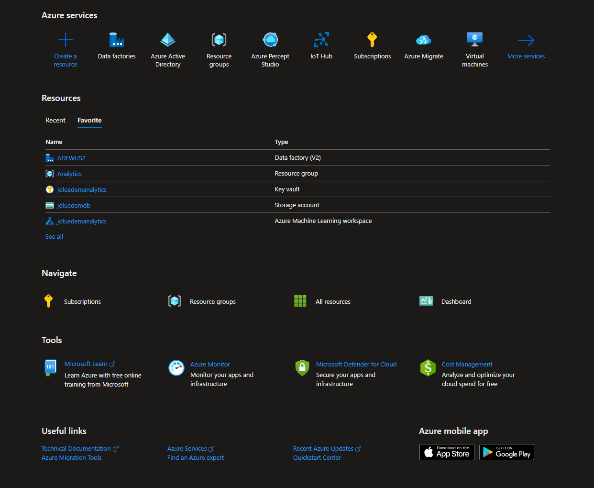
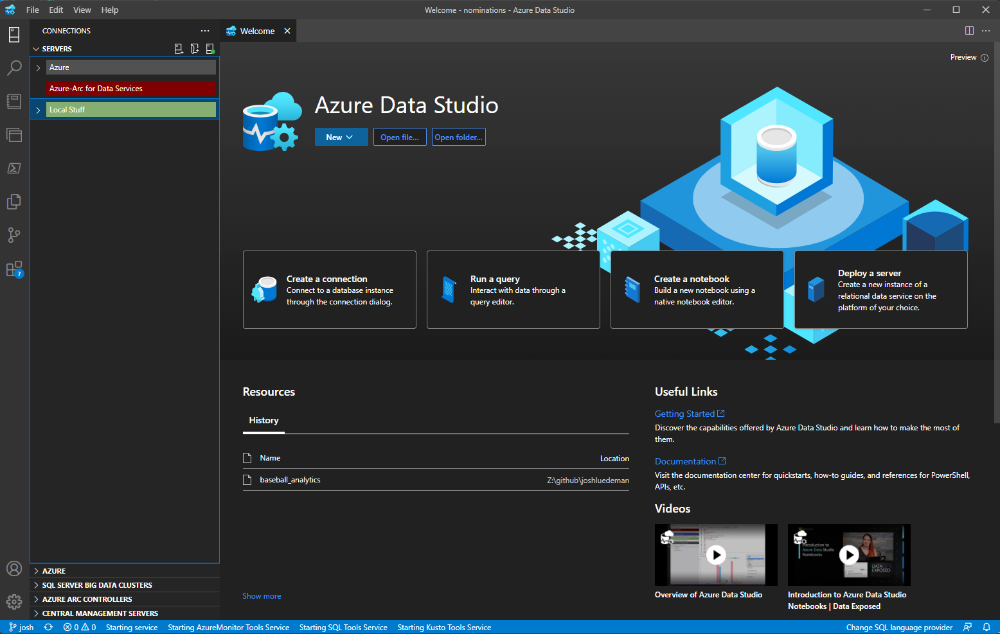

# Workshop: Modernizing Your Data Estate With SQL Ground-to-Cloud
#### <i>A Microsoft workshop from the SQL Server team</i>

 <h2>04 - Microsoft Azure SQL Improvements</h2>

In the previous modules, you learned about how to <a href="https://github.com/sqlballs/mSQLg2c/blob/Josh/modules/02-AuditingYourDataEstateArchitecture.md" target="_blank"> <b>audit your data estate</b></a>, and the most recent <a href="https://github.com/sqlballs/mSQLg2c/blob/Josh/modules/03-SQLServerImprovements.md" target="_blank"><b>SQL Server improvements</a>.</b> In this module, you will learn about the different options available for running SQL Server in Azure and all the considerations that are involved with running an architecture in the cloud, like Manageability, Availability, Performance, Security, and Deployment.

(As a reminder, make sure you check out the <a href="https://github.com/sqlballs/mSQLg2c/blob/Josh/modules/01-SetupandWorkshopMethodology.md" target="_blank"><b>Pre-Requisites</b></a> page before you start. You'll need all of the items loaded there before you can proceed with the workshop.)

You'll cover these topics in the workshop:
<dl>

  <dt><a href="#4.1" target="_blank">4.1 - Deployment Options<dt>
  <dt><a href="#4.2" target="_blank">4.2 - Manageability<dt>
  <dt><a href="#4.3" target="_blank">4.3 - Availability<dt>
  <dt><a href="#4.4" target="_blank">4.4 - Performance<dt>
  <dt><a href="#4.5" target="_blank">4.5 - Security<dt>
  <dt><a href="#4.6" target="_blank">4.6 - Development<dt>

</dl>

<h2 id="4.1">4.1 Deployment Options</h2></a>

  

<h3>SQL Server on Microsoft Azure VM's</h3>

Azure SQL VMs don't have specific service tiers, but there are decisions to be made around which images to choose, how to configure storage and what sizes, etc. This isn't the focus of this workshop, but if you're considering Azure SQL VMs, you'll want to review the [guidance on images to choose from](https://docs.microsoft.com/en-us/azure/virtual-machines/windows/sql/virtual-machines-windows-sql-server-iaas-overview), the [quick checklist](https://docs.microsoft.com/en-us/azure/virtual-machines/windows/sql/virtual-machines-windows-sql-performance) to obtain optimal performance of Azure SQL VMs, and the guidance for [storage configuration](https://docs.microsoft.com/en-us/azure/virtual-machines/windows/sql/virtual-machines-windows-sql-server-storage-configuration).  

Recently, [Resource Provider](http://www.aka.ms/sqlvm_rp_documentation) was [announced](http://www.aka.ms/sqlvm_rp), which brings the functionality of Azure Marketplace images to SQL Server instances self-installed on Azure VMs.  

> Note: If you're specifically looking at SQL Server on RHEL Azure VMs, there's a full operations guide available [here](https://azure.microsoft.com/en-us/resources/sql-server-on-rhel-azure-vms-operations-guide/
).  
  
> Note: In an earlier module of this workshop, you learned about some of the problems SQL Server 2019 is solving. The same applies in an Azure SQL VM (if you choose 2019 as the target).  

<h3>SQL Server Managed Instance</h3>

Azure SQL Managed Instance is the intelligent, scalable cloud database service that combines the broadest SQL Server database engine compatibility with all the benefits of a fully managed and evergreen platform as a service. SQL Managed Instance has near 100% compatibility with the latest SQL Server (Enterprise Edition) database engine, providing a native virtual network (VNet) implementation that addresses common security concerns, and a business model favorable for existing SQL Server customers. SQL Managed Instance allows existing SQL Server customers to lift and shift their on-premises applications to the cloud with minimal application and database changes. At the same time, SQL Managed Instance preserves all PaaS capabilities (automatic patching and version updates, automated backups, high availability) that drastically reduce management overhead and TCO.

<h3>Azure SQL Database</h3>

For Azure SQL Database, there are several options and tiers available, and the choices will depend on the scenario.  

There are a few main decisions to be made, which will be explored next.    

*Decision 1: Choose the purchasing model*  
You have two options, [virtual core (vCore)-based](https://docs.microsoft.com/en-us/azure/sql-database/sql-database-service-tiers-vcore) (recommended) or [Database transaction unit (DTU)-based](https://docs.microsoft.com/en-us/azure/sql-database/sql-database-service-tiers-dtu
).     

The vCore-based model is recommended because it allows you to independently choose compute and storage resources, while the DTU-based model is a bundled measure of compute, storage and I/O resources, which means you have less control over paying only for what you need. This model also allows you to use [Azure Hybrid Benefit for SQL Server](https://azure.microsoft.com/pricing/hybrid-benefit/) to gain cost savings. In the [vCore model](https://docs.microsoft.com/en-us/azure/sql-database/sql-database-service-tiers-vcore), you pay for:  

* Compute resources (the service tier + the number of vCores and the amount of memory + the generation of hardware).
* The type and amount of data and log storage.
* Backup storage ([read-access, geo-redundant storage (RA-GRS)](https://docs.microsoft.com/en-us/azure/storage/common/storage-designing-ha-apps-with-ragrs)).  

For the purposes of this workshop, we'll focus on the vCore purchasing model (recommended), but you can [compare vCores and DTUs here](https://docs.microsoft.com/en-us/azure/sql-database/sql-database-purchase-models
).

*Decision 2: Choose service tier for performance and availability*  
There are three tiers available in the vCore model for Azure SQL Database:
* **[General purpose](https://docs.microsoft.com/en-us/azure/sql-database/sql-database-service-tier-general-purpose)**: Most business workloads. Offers budget-oriented, balanced, and scalable compute and storage options.
* **[Business critical](https://docs.microsoft.com/en-us/azure/sql-database/sql-database-service-tier-business-critical)**: Business applications with low-latency response requirements. Offers highest resilience to failures by using several isolated replicas. This is the only tier that can leverage [in-memory OLTP](https://docs.microsoft.com/en-us/azure/sql-database/sql-database-in-memory) to improve performance.
* **[Hyperscale](https://docs.microsoft.com/en-us/azure/sql-database/sql-database-service-tier-hyperscale)**: Most business workloads with highly scalable storage and read-scale requirements. *Currently only available for single databases, not managed instances*. We'll talk more about this in separate section specifically for Hyperscale.

A member of the Product Group recently released a [blog](https://azure.microsoft.com/en-gb/blog/understanding-and-leveraging-azure-sql-database-sla/) and [video](https://www.youtube.com/watch?v=l7FUNJd5TSE) explaining the SLA (service level agreements that set an expectation for uptime and performance). This resource will help you make an informed decision about which tier to move to.  

For a deeper explanation between the three tiers (including scenarios), you can also refer to the [service-tier characteristics](https://docs.microsoft.com/en-us/azure/sql-database/sql-database-service-tiers-vcore#service-tier-characteristics) in the documentation.  

*Decision 3: Provisioned or serverless compute?*  
If you choose **General Purpose within Single databases** and the **vCore-based model**, you have an additional decision to make regarding the compute that you pay for:
* **Provisioned compute** is meant for more regular usage patterns with higher average compute utilization over time, or multiple databases using elastic pools. 
* **Serverless compute** is meant for intermittent, unpredictable usage with lower average compute utilization over time. Serverless has auto-pause and resume capabilities (with a time delay you set), meaning when your database is paused, you only pay for storage. 

For a deeper explanation between the two compute options (including scenarios), you can refer to the detailed [comparison in the documentation](https://docs.microsoft.com/en-us/azure/sql-database/sql-database-serverless#comparison-with-provisioned-compute-tier).  

> If you're looking for compute cost saving opportunities, you can prepay for compute resources with [Azure SQL Database reserved capacity](https://docs.microsoft.com/en-us/azure/sql-database/sql-database-reserved-capacity).

*Decision 4: Choose hardware generation*  
The vCore model lets you choose the generation of hardware:  
* **Gen4**: Up to 24 logical CPUs based on Intel E5-2673 v3 (Haswell) 2.4-GHz processors, vCore = 1 PP (physical core), 7 GB per core, attached SSD
* **Gen5**: Up to 80 logical CPUs based on Intel E5-2673 v4 (Broadwell) 2.3-GHz processors, vCore = 1 LP (hyper-thread), 5.1 GB per core, fast eNVM SSD  

Basically, Gen4 hardware offers substantially more memory per vCore. However, Gen5 hardware allows you to scale up compute resources much higher. 

> Note: If you choose General Purpose within Single databases and want to use the serverless compute tier, Gen5 hardware is the only option.  

<h3>Azure SQL Database Hyperscale</h3>

The Hyperscale service tier in Azure SQL Database is the newest service tier in the vCore-based purchasing model. This service tier is a highly scalable storage and compute performance tier that uses the Azure architecture to scale out the storage and compute resources for an Azure SQL Database substantially beyond the limits available for the General Purpose and Business Critical service tiers.

<b>Review Azure SQL Hyperscale architecture</b>

Gain a fuller understanding of the compute, page server, log service, and how Hyperscale works with Azure storage. 

<b>In this activity we will review the architecture of Azure SQL Hyperscale</b>

Click on the following <a href="https://learn.microsoft.com/en-us/azure/azure-sql/database/hyperscale-architecture?view=azuresql#hyperscale-architecture-overview">Link</a>.

<b>Review these sections of the document</b>

- Hyperscale architecture overview
- Compute
- Page server
- Log service
- Azure storage

<h3>Microsoft Azure Synapse</h3>

Azure Synapse is an enterprise analytics service that accelerates time to insight across data warehouses and big data systems. Azure Synapse brings together the best of SQL technologies used in enterprise data warehousing, Spark technologies used for big data, Data Explorer for log and time series analytics, Pipelines for data integration and ETL/ELT, and deep integration with other Azure services such as Power BI, CosmosDB, and AzureML.

For a deeper overview of Azure Synapse read this MS Learn article <a href="https://learn.microsoft.com/en-us/azure/synapse-analytics/overview-what-is">Azure Synapse Overview - What is Azure Synapse?</a>

### *Summary*  
As you've hopefully noticed, while there are a lot of options, Azure is able to provide flexibility so you get exactly what you need, nothing less. A summary of the service tier options with some additional considerations is included below, but be sure to check out [pricing information](https://azure.microsoft.com/en-us/pricing/details/sql-database/managed/) for the latest details.

<h2 id="4.2">4.2 Manageability</h2>

While managing SQL Server in the cloud is somewhat different than managing on premises instances, the tools and methodologies that you will use are mostly the same tools and methodologies that you used in your on premises environment. In this module, we'll walk through some of the tools. Some you will be familiar with, and some will be new.

<h3>Tools</h3>

Depending on the deployment option of Azure SQL you choose, the manageability tools are the same or very similar to the tools you are already used to. In this section, we'll go through the different options show an overview of the tool, what you would use it for, and what tool it would be comparable to in your on premises environment.

<h4>Azure Portal</h4>

The Azure Portal is the first stop in managing your Azure environment. The portal to allows you to deploy, manage, monitor, or delete resources in your subscription. From a hands-on perspective, it is one of the most powerful single tools in your "tool belt".

* [Built-in monitoring](https://docs.microsoft.com/en-us/azure/log-analytics/log-analytics-azure-sql) capabilities enable you to get the insights into performance of your databases and workload, and troubleshoot the performance issues.

<h4>Azure Data Studio</h4>

Azure Data Studio is a highly extensible tool that helps developers to manage and develop against multiple data processing and storage engines. Its versatility through the use of application extensions allows it to be as useful as the developer can make it.

For instance, there are extensions for helping developers to migrate to Azure SQL, develop "clean" looking code, monitor and manage Azure Synapse, work on PostgreSQL instances, or even develop using Jupyter Notebooks

<h4>Jupyter Notebooks</h4>

A Jupyter *Notebook* is a web-page-based interface consisting of *Cells* that can contain text (using the Markdown specification) or code. The code depends on the Kernel that has been installed for the Notebook. Traditionally, Python and R Kernels are installed by default. 

*Notebook Servers* run **.ipynb** files (the Notebooks). You can install a Notebook Server locally, remotely, or you can use something like <a href="https://notebooks.azure.com" target="_blank">Azure Notebooks</a> which provides a free, quick, easy way to work with and share Notebooks. (It's all a bit like a specific kind of web server). 

*Libraries* are a container on your Notebook server where you can have Notebooks, code, directories and other files. 

Notebooks are JSON files that contain areas called *Cells*, which have text or code in them. When you double-click a Notebook, the Notebook server renders and can display text or run code, such as R or Python, using a *Kernel*. Cells can hold text (such as *Markdown*, *HTML*, or *LaTeX*) which you can mix together, or Code. Double-click a Cell in a Notebook to edit it, and then click the "Run" button to render what you typed. Code runs and displays an output below the cell. You can toggle the result for code to show or hide it.

*Markdown* is a simplified markup language for text. Use it for general text and simple graphics. You can <a href="https://www.markdowntutorial.com/" target="_blank">read more about Markdown here</a>, and <a href="https://github.com/adam-p/markdown-here/wiki/Markdown-Cheatsheet" target="_blank">there's a great cheat-sheet on Markdown here</a>. 

You'll use Notebooks within Azure Data Studio to work with Spark, which you'll learn about in a moment. Learn <a href="https://jupyter-notebook.readthedocs.io/en/stable/" target="_blank">more about Jupyter Notebooks here</a>.  

<h4>Azure Data Studio</h4>

*Azure Data Studio* is a cross-platform database tool to manage and program on-premises and cloud data platforms on Windows, MacOS, and Linux. It is extensible, and one of these extensions is how you work with Azure Data Studio code and Jupyter Notebooks. It is built on the Visual Studio Code shell. The editor in Azure Data Studio has Intellisense, code snippets, source control integration, and an integrated terminal. 

If you have not completed the prerequisites for this workshop you can <a href="https://docs.microsoft.com/en-us/sql/azure-data-studio/download?view=sql-server-2017
" target="_blank">install Azure Data Studio from this location</a>, and you will install the Extension to work with SQL Server big data clusters in a future module</a>.

You can <a href="https://docs.microsoft.com/en-us/sql/azure-data-studio/what-is?view=sql-server-2017 
" target="_blank">learn more about Azure Data Studio here</a>.

 

 	 	
 

You'll explore further operations with the Azure Data Studio in the <i>Operationalization</i> module.

 

<b>Activity: Practice with Notebooks</b>

<b>Steps</b>

<a href="https://notebooks.azure.com/BuckWoodyNoteBooks/projects/AzureNotebooks" target="_blank">Open this reference, and review the instructions you see there</a>. You can clone this Notebook to work with it later.

 

<b>Activity: Azure Data Studio Notebooks Overview</b>

<b>Steps</b>

<a href="https://docs.microsoft.com/en-us/sql/azure-data-studio/sql-notebooks?view=sql-server-2017" target="_blank">Open this reference, and read the tutorial - you do not have to follow the steps, but you can if time permits.

 

 

<h4>Command-Line Utilities</h4>

##### Azure CLI

The Azure command-line interface ([Azure CLI](https://learn.microsoft.com/en-us/cli/azure/)) is a set of commands used to create and manage Azure resources. The Azure CLI is available across Azure services and is designed to get you working quickly with Azure, with an emphasis on automation. 

With this utility, developers can do almost everything that can be done in the Azure portal, and codify it so that it can be automated for consistent and repeatable execution.

##### SQLCMD ?

SQLCMD is a versatile tool that allows developers to get command line access to SQL Server, without using a tool like Azure Data Studio.

 

 

<b>Activity: Overview of Azure Data Studio</b>

<b>Walkthrough of Azure Data Studio and installation guidance</b>

Azure Data Studio is a great cross platform management tool for your Azure data services like Azure SQL, Azure Database for Postgres, and Azure Data Explorer. There are also custom extensions for customer to use, or create, to simplify their day-to-day activities.

<b>Steps</b>

<b>Watch the following YouTube Video
</b>

[Overview of Azure Data Studio](https://www.youtube.com/watch?v=Orv7fptVoUA)

<b>Overview of and Install Azure Data Studio
</b>

[Overview of Azure Data Studio](https://learn.microsoft.com/en-us/sql/azure-data-studio/what-is-azure-data-studio)

[Install Azure Data Studio](https://learn.microsoft.com/en-us/sql/azure-data-studio/download-azure-data-studio)

<h2 id="4.3">4.3 Availability</h2>

Earlier we reviewed some of the key concepts around Availability.  With an understanding of those concepts it is importaint to understand some of the key features you gain in Azure SQL.

* [Azure Availability Zones](https://learn.microsoft.com/en-us/azure/availability-zones/az-overview) are physically separate locations within each Azure region that are tolerant to local failures.
* [Business continuity](https://docs.microsoft.com/en-us/azure/sql-database/sql-database-business-continuity) enables your business to continue operating in the face of disruption, particularly to its computing infrastructure.

* [Azure SQL Database High availability](https://docs.microsoft.com/en-us/azure/sql-database/sql-database-high-availability) of Azure SQL Database guarantees your databases are up and running 99.99% of the time, no need to worry about maintenance/downtimes.

* [Azure SQL Managed Instance Auto-Failover Groups](https://learn.microsoft.com/en-us/azure/azure-sql/managed-instance/auto-failover-group-sql-mi?view=azuresql&tabs=azure-powershell) feature allows you to manage the replication and failover of all user databases in a managed instance to another Azure region.

* [Automated backups](https://docs.microsoft.com/en-us/azure/sql-database/sql-database-automated-backups) are created and use Azure read-access geo-redundant storage (RA-GRS) to provide geo-redundancy.
* [Long term backup retention](https://docs.microsoft.com/en-us/azure/sql-database/sql-database-long-term-retention) enables you to store specific full databases for up to 10 years.
* [Geo-replication](https://docs.microsoft.com/en-us/azure/sql-database/sql-database-active-geo-replication) by creating readable replicas of your database in the same or different Azure Region.

<b>Activity: Azure SQL Availability</b>

Watch video from Anna Hoffman and Bob Ward

<b>Description</b>

This video will walk you through considerations for when looking at high availability and disaster recovery needs and features in Azure SQL.

<b>Steps</b>

[Availability Capabilities and Tasks Video](https://www.youtube.com/watch?v=OJVXH_dPAEA
)

[Azure Docs: High Availability for Azure SQL Database and SQL Managed Instance](https://learn.microsoft.com/en-us/azure/azure-sql/database/high-availability-sla?view=azuresql&tabs=azure-powershell)

<h2 id="4.4">4.4 Performance</h2>

Azure can feel like a forgien land compared to the familiarity of SQL Server on a VM.  In moments such as that it is importaint to remember that this is the same database engine we have on premise.  The key to performance tuning on premises is the same in Azure.

* [Explain estimated and actual query plans.](https://learn.microsoft.com/en-us/training/modules/explore-query-performance-optimization/3-explain-estimated-actual?ns-enrollment-type=learningpath&ns-enrollment-id=learn.wwl.optimize-query-performance-sql-server) The topic of actual versus estimated execution plans can be confusing. The difference is that the actual plan includes runtime statistics that aren't captured in the estimated plan. The operators used, and order of execution will be the same as the estimated plan in nearly all cases. 
* [The Query Data Store](https://learn.microsoft.com/en-us/training/modules/explore-query-performance-optimization/5-explore-query-store) The SQL Server Query Store is a per-database feature that automatically captures a history of queries, plans, and runtime statistics to simplify performance troubleshooting and query tuning. It also provides insight into database usage patterns and resource consumption. This is on by default in all Azure SQL Databases.
* [Wait Statistics](https://learn.microsoft.com/en-us/training/modules/evaluate-performance-improvements/2-describe-wait-statistics?ns-enrollment-type=learningpath&ns-enrollment-id=learn.wwl.optimize-query-performance-sql-server) When SQL Server executes any process it must wait for resources.  As that occurs Wait Statistics are accumulated by the SQL OS.  Wait Statistics will tell you what Azure SQL is waiting on.  If it is a hardware wait stat, then you may need to consider increasing your service teir.
* [Auto Scaling](https://docs.microsoft.com/en-us/azure/sql-database/sql-database-scale-resources) Azure Serverless database or regular scaling Azure SQL Database, Managed Instance, or Synapse may be key to resolving hardware performance.
* [Tune and maintain indexes.](https://learn.microsoft.com/en-us/training/modules/evaluate-performance-improvements/3-tune-and-maintain-indexes?ns-enrollment-type=learningpath&ns-enrollment-id=learn.wwl.optimize-query-performance-sql-server) The most common (and most effective) method for tuning T-SQL queries is to evaluate and adjust your indexing strategy.
* [Automatic tuning](https://docs.microsoft.com/en-us/azure/sql-database/sql-database-automatic-tuning) analyzes your workload and provides you the recommendations that can optimize performance of your applications by adding indexes, removing unused indexes, and automatically fixing the query plan issues.
* [Built-in intelligence](https://docs.microsoft.com/en-us/azure/sql-database/sql-database-intelligent-insights) automatically identifies the potential issues in your workload and provides you the recommendations that can [help you to fix the problems](https://azure.microsoft.com/en-us/blog/ai-helped-troubleshoot-an-intermittent-sql-database-performance-issue-in-one-day/). 

<b>Activity: Performance Improvements</b>

Watch videos

<b>Automatic Tuning</b>

Automatic tuning in Azure SQL is a great feature that analyzes your workload and gives recommndations on configuration changes you can make to improve performance. In this video, you are given an overview of the feature.

<b>Steps</b>

 [Improve Performance Tuning with Automatic Tuning](https://www.youtube.com/watch?v=HQantpWg3sg)

<h2 id="4.5">4.5 Security</h2>

Security is at the core of everything we do.  There is not just one are of concern for each product but multiple shared capabilities in Azure.

For an overview of Azure SQL Database and Azure SQL Managed Instance security capabilities review this <a href="https://learn.microsoft.com/en-us/azure/azure-sql/database/security-overview?view=azuresql">MS Learn article.</a> 

* <b>[Network security](https://learn.microsoft.com/en-us/azure/azure-sql/database/security-overview?view=azuresql#network-security) </b>- To help protect customer data, firewalls prevent network access to the server until access is explicitly granted based on IP address or Azure Virtual network traffic origin.

* <b>[IP firewall rules](https://learn.microsoft.com/en-us/azure/azure-sql/database/security-overview?view=azuresql#network-security)</b> - IP firewall rules grant access to databases based on the originating IP address of each request. For more information, see <a href="https://learn.microsoft.com/en-us/azure/azure-sql/database/firewall-configure?view=azuresql">Overview of Azure SQL Database and Azure Synapse Analytics firewall rules.</a>

* <b>[Virtual network firewall rules](https://learn.microsoft.com/en-us/azure/azure-sql/database/security-overview?view=azuresql#virtual-network-firewall-rules)</b> - Virtual network service endpoints extend your virtual network connectivity over the Azure backbone and enable Azure SQL Database to identify the virtual network subnet that traffic originates from. To allow traffic to reach Azure SQL Database, use the SQL service tags to allow outbound traffic through Network Security Groups.

* <b>[Access management](https://learn.microsoft.com/en-us/azure/azure-sql/database/security-overview?view=azuresql#access-management)</b> - Managing databases and servers within Azure is controlled by your portal user account's role assignments. 

* <b>[Authentication](https://learn.microsoft.com/en-us/azure/azure-sql/database/security-overview?view=azuresql#authentication)</b> - Authentication is the process of proving the user is who they claim to be. Azure SQL Database and SQL Managed Instance support SQL authentication and Azure AD authentication. SQL Managed instance additionally supports Windows Authentication for Azure AD principals.

* <b>[Authorization](https://learn.microsoft.com/en-us/azure/azure-sql/database/security-overview?view=azuresql#authorization)</b> - Authorization refers to controlling access on resources and commands within a database. This is done by assigning permissions to a user within a database in Azure SQL Database or Azure SQL Managed Instance. Permissions are ideally managed by adding user accounts to database roles and assigning database-level permissions to those roles. Alternatively an individual user can also be granted certain object-level permissions. 

* <b>[Row-level security](https://learn.microsoft.com/en-us/azure/azure-sql/database/security-overview?view=azuresql#row-level-security)</b> - Row-Level Security enables customers to control access to rows in a database table based on the characteristics of the user executing a query (for example, group membership or execution context). Row-Level Security can also be used to implement custom Label-based security concepts.

* <b>[SQL auditing in Azure Monitor logs and Event Hubs](https://learn.microsoft.com/en-us/azure/azure-sql/database/security-overview?view=azuresql#sql-auditing-in-azure-monitor-logs-and-event-hubs)</b> - SQL Database and SQL Managed Instance auditing tracks database activities and helps maintain compliance with security standards by recording database events to an audit log in a customer-owned Azure storage account. Auditing allows users to monitor ongoing database activities, as well as analyze and investigate historical activity to identify potential threats or suspected abuse and security violations. 

* <b>[Advanced Threat Protection](https://learn.microsoft.com/en-us/azure/azure-sql/database/security-overview?view=azuresql#advanced-threat-protection)</b>Advanced Threat Protection is analyzing your logs to detect unusual behavior and potentially harmful attempts to access or exploit databases. Alerts are created for suspicious activities such as SQL injection, potential data infiltration, and brute force attacks or for anomalies in access patterns to catch privilege escalations and breached credentials use. Alerts are viewed from the Microsoft Defender for Cloud, where the details of the suspicious activities are provided and recommendations for further investigation given along with actions to mitigate the threat. Advanced Threat Protection can be enabled per server for an additional fee. 

* <b>[Transport Layer Security](https://learn.microsoft.com/en-us/azure/azure-sql/database/security-overview?view=azuresql#transport-layer-security-encryption-in-transit)</b>SQL Database, SQL Managed Instance, and Azure Synapse Analytics enforce encryption (SSL/TLS) at all times for all connections. This ensures all data is encrypted "in transit" between the client and server irrespective of the setting of Encrypt or TrustServerCertificate in the connection string.

* <b>[Transparent Data Encryption (Encryption-at-rest)](https://learn.microsoft.com/en-us/azure/azure-sql/database/security-overview?view=azuresql#transparent-data-encryption-encryption-at-rest)</b> SQL Database, SQL Managed Instance, and Azure Synapse Analytics enforce encryption (SSL/TLS) at all times for all connections. This ensures all data is encrypted "in transit" between the client and server irrespective of the setting of Encrypt or TrustServerCertificate in the connection string.

* <b>[Key management with Azure Key Vault](https://learn.microsoft.com/en-us/azure/azure-sql/database/security-overview?view=azuresql#key-management-with-azure-key-vault)</b> Bring Your Own Key (BYOK) support for Transparent Data Encryption (TDE) allows customers to take ownership of key management and rotation using Azure Key Vault, Azure's cloud-based external key management system.

* <b>[Always Encrypted (Encryption-in-use)](https://learn.microsoft.com/en-us/azure/azure-sql/database/security-overview?view=azuresql#always-encrypted-encryption-in-use)</b> Always Encrypted is a feature designed to protect sensitive data stored in specific database columns from access (for example, credit card numbers, national identification numbers, or data on a need to know basis). This includes database administrators or other privileged users who are authorized to access the database to perform management tasks, but have no business need to access the particular data in the encrypted columns.

* <b>[Dynamic data masking](https://learn.microsoft.com/en-us/azure/azure-sql/database/security-overview?view=azuresql#dynamic-data-masking)</b> Dynamic data masking limits sensitive data exposure by masking it to non-privileged users. Dynamic data masking automatically discovers potentially sensitive data in Azure SQL Database and SQL Managed Instance and provides actionable recommendations to mask these fields, with minimal impact to the application layer.

* <b>[Data discovery and classification](https://learn.microsoft.com/en-us/azure/azure-sql/database/security-overview?view=azuresql#data-discovery-and-classification)</b> Data discovery and classification (currently in preview) provides basic capabilities built into Azure SQL Database and SQL Managed Instance for discovering, classifying and labeling the sensitive data in your databases. Discovering and classifying your utmost sensitive data (business/financial, healthcare, personal data, etc.) can play a pivotal role in your organizational Information protection stature

* <b>[Vulnerability assessment](https://learn.microsoft.com/en-us/azure/azure-sql/database/security-overview?view=azuresql#dynamic-data-masking)</b> Vulnerability assessment is an easy to configure service that can discover, track, and help remediate potential database vulnerabilities with the goal to proactively improve overall database security. Vulnerability assessment (VA) is part of the Microsoft Defender for SQL offering, which is a unified package for advanced SQL security capabilities. 

* <b>[Virtual Network Service Endpoints](https://learn.microsoft.com/en-us/azure/virtual-network/virtual-network-service-endpoints-overview)</b> extend your virtual network over the Azure networking backbone and identify, and block if need be, traffic from a specific azure virtual network subnet that the traffic is originating from.

<b>Activity: TODO: Activity Name</b>

Manage security and Microsoft Defender for Cloud

<b>Defender for Cloud</b>

Sign into Microsoft Learn on this [link](https://learn.microsoft.com/en-us/training/modules/azure-sql-secure-data/8-exercise-advanced-data-security?ns-enrollment-type=learningpath&ns-enrollment-id=learn.azure-sql-fundamentals).  Complete Unit 8 of 10 Secure your data with Azure SQL.  

<b>Steps</b>

Follow the steps in Exercise - Manage security and Microsoft Defender for Cloud.

<b>Steps</b>

Procede to Unit 9 Learn about Data classification, dynamic data masking, and SQL Audit in this MS Learn Module.  

<h2 id="4.6">4.6 Development</h2>

When you have your envrionment in Azure there is a world of additional options availble to your architecture and development practices.  In this section we will explore some of the development features in Azure SQL and in Azure. 

* <b>[Spider-man Homecoming Twitter Sentiment Analysis](https://learn.microsoft.com/en-us/archive/blogs/deeperinsights/how-to-measure-twitter-sentiment-with-azure-logic-apps-sql-database-and-power-bi)</b> - A true Azure Development story showing how in less than an hour and a few clicks you can get real world data, use Congnative Services, evaluate sentiment, and enrich data in your Azure SQL Database.  Then you can report off of it in Power BI. 

<b>For Further Study</b>

<ul>
        <li><a href="url" target="_blank">TODO: Enter courses, books, posts, whatever the student needs to extend their study</a></li>
</ul>

Next, continue on to [Module 05 - Extending SQL Server to the Microsoft Azure Platform](https://github.com/sqlballs/mSQLg2c/blob/main/modules/05-ExtendingSQLServerToAzure.md)

  

Azure SQL Database (including single databases, elastic pools, and managed instances) is a fully managed Database Engine that automates most of the database management functions such as upgrading, patching, backups, and monitoring. Some of the built-in capabilities include:  

> Note: Many benefits typically thought of as Platform as a Service (PaaS) are surfacing in Infrastructure as a Service (IaaS). You can learn more about automated updates, automated backups, high availability, and performance provided in Azure SQL VMs [here](https://docs.microsoft.com/en-us/azure/virtual-machines/windows/sql/virtual-machines-windows-sql-server-iaas-overview).  

In addition to the resources linked to above, several [slide decks](https://aka.ms/azuresqlslides) are available (with notes and animations) that you can review to learn more. You can also check out the [Core Cloud Services - Azure architecture and service guarantees](https://docs.microsoft.com/en-us/learn/modules/explore-azure-infrastructure/) module from Microsoft Learn.  
 

